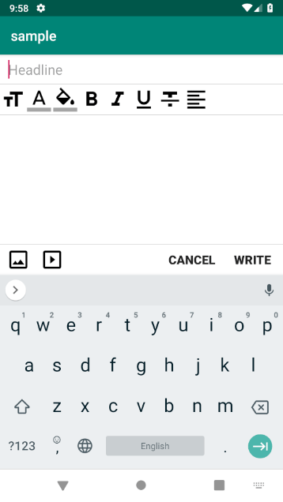
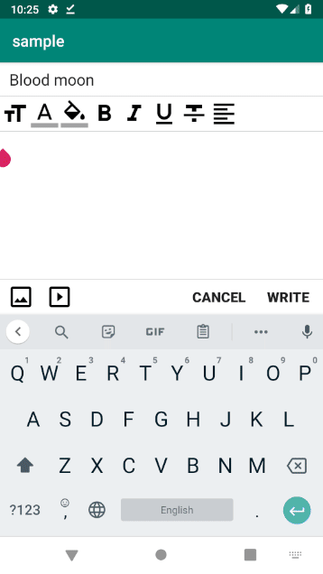
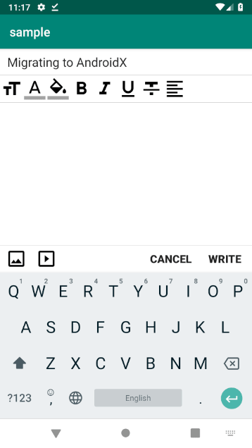
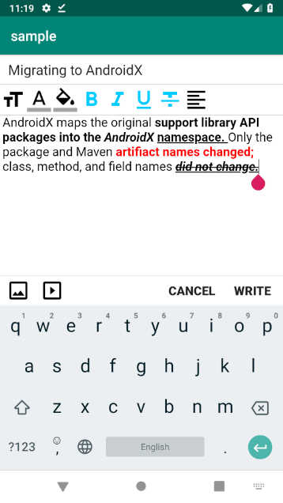
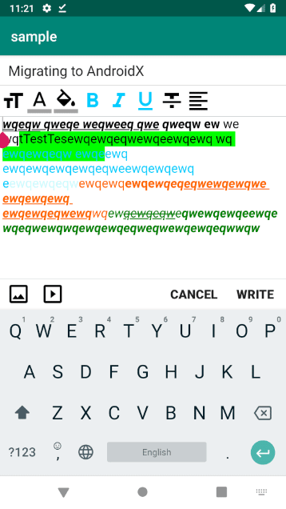

# Android-Rich-Wysiwyg-Editor
### Demo
 
 
 
 
 
 

### AndroidX
Android-RichWYSIWYGEditor uses AndroidX  
You should migrate your project to AndroidX (How to migrate: https://developer.android.com/jetpack/androidx/migrate)  

### Functions
- [ ] Text Size
- [x] Text Color
- [x] Text Background Color
- [x] Text Bold
- [x] Text Italic
- [x] Text Underline
- [x] Text Strike Through
- [x] Content Align
- [x] Insert Image
- [x] Insert Youtube

### Todo List
1. Add other functions.  
2. Refactory variable names & Popup Fucntions.  
3. Fix html default background color bugs.  
4. Add Function Button setting method.

## How to use it
### Setup
Add this maven to your ```project's``` build.gradle
```
repositories {
    maven { url "https://jitpack.io" }
}
```

And add this to your ```module's``` build.gradle
```
implementation 'com.github.lumyjuwon:Android-Rich-Wysiwyg-Editor:1.0.0'
```
### Sample
```
    private RichWysiwyg wysiwyg;

    @Override
    protected void onCreate(Bundle savedInstanceState) {
        super.onCreate(savedInstanceState);
        setContentView(R.layout.activity_main);
        wysiwyg = findViewById(R.id.richwysiwygeditor);
        
        wysiwyg.getContent()
                .setEditorFontSize(18)
                .setEditorPadding(4, 0, 4, 0);
        
        wysiwyg.getHeadlineEditText().setHint("Headline");
        
        wysiwyg.getCancelButton().setText("Cancel");
        
        wysiwyg.getConfirmButton().setText("Confirm");
        wysiwyg.getConfirmButton().setOnClickListener(new Button.OnClickListener(){
            @Override
            public void onClick(View v){
                // Handle this
                Log.i("Rich Wysiwyg Headline", wysiwyg.getHeadlineEditText().getText().toString());
                if(wysiwyg.getContent().getHtml() != null)
                    Log.i("Rich Wysiwyg", wysiwyg.getContent().getHtml());
            }
        });
    }

    @Override
    protected void onActivityResult(int requestCode, final int resultCode, Intent data) {
        if (ImagePicker.shouldHandle(requestCode, resultCode, data)) {
            List<Image> images = ImagePicker.getImages(data);
            insertImages(images);
        }
        super.onActivityResult(requestCode, resultCode, data);
    }

    private void insertImages(List<Image> images) {
        if (images == null) return;

        StringBuilder stringBuffer = new StringBuilder();
        for (int i = 0, l = images.size(); i < l; i++) {
            stringBuffer.append(images.get(i).getPath()).append("\n");
            // Handle this
            wysiwyg.getContent().insertImage("file://" + images.get(i).getPath(), "A");
        }
    }
```

## Credits
ImagePicker: https://github.com/esafirm/android-image-picker  
RichEditor: https://github.com/wasabeef/richeditor-android  
Google Material Icon Design: https://material.io/tools/icons/?style=baseline

## License
```
Copyright 2019 lumyjuwon

Licensed under the Apache License, Version 2.0 (the "License");
you may not use this file except in compliance with the License.
You may obtain a copy of the License at

    http://www.apache.org/licenses/LICENSE-2.0

Unless required by applicable law or agreed to in writing, software
distributed under the License is distributed on an "AS IS" BASIS,
WITHOUT WARRANTIES OR CONDITIONS OF ANY KIND, either express or implied.
See the License for the specific language governing permissions and
limitations under the License.
```
